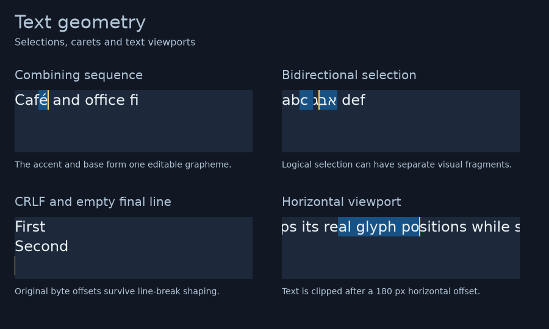

# WU-0024 verification: text editing geometry and native IME context

Status: bounded increment verified; product goal remains active
Branch: `feat/text-editing-geometry`
Baseline: `65c2571`
Environment: Linux x86_64, Fedora 43, Wayland, Rust 1.97.1
Date: 2026-09-08 UTC

## Implemented boundary

The [owned geometry contract](../design/text-editing-geometry.md) adds original
UTF-8 positions with affinity, directed selection, grapheme-safe hit testing,
visual horizontal movement, wrapped-line boundaries, vertical movement with a
retained preferred x, caret rectangles and disjoint selection highlights.
Geometry has full text coordinates and independent rectangle limits. The
scroll extent includes trailing whitespace and empty final lines.

Explicit text viewports shape at an independent wrap width, translate actual
glyph positions and clip to a bounded raster. Their full metrics remain the
same as the equivalent measurement/geometry request. Old custom engines keep
their existing layout behavior and return typed unavailability for unsupported
new queries or viewport modes.

Native content can provide an owned `ImeContext` with checked physical caret
bounds and a window-local editor identity. The bridge gates managed contexts
on focus and drawable size, enables before supplying an area, resets editor
transfers and avoids repeated unchanged platform calls. Successful input,
resize, presentation and accessibility-action callbacks refresh the context.
Absent context retains the previous static window option exactly.

## Regressions and candidate corrections

The initial public boundary tests failed against compiling validation stubs.
The completed contract rejects invalid source positions, nonfinite/reversed
coordinates, malformed carets, excessive rectangles and inconsistent query
results. The query postcondition test separately reproduced a non-collapsed
result being accepted for a non-extending hit. All 11
[public contract tests](../../crates/fenestra-ui/tests/text_geometry.rs) pass.

The real adapter reproduced these failures before correction:

- A hit could return a byte inside an extended combining grapheme. Candidate
  positions now resolve to valid surrounding source boundaries using shaped
  caret geometry; no independently measured string prefixes are used.
- CRLF produced two hard breaks. A shaping-only projection now treats it as
  one break while preserving original source offsets in every public result.
- Emergency wrapping split Arabic beh with shadda between lines. The pinned
  line breaker now consumes complete logical RTL/LTR component groups and uses
  run-relative, bounded lookahead before deciding whether the group fits.
- RTL text before a hard break could place its first caret on the next line,
  omit the first selection highlight and misdirect Home/End. Logical neighbor
  attachment now fixes those paths and the empty final line together.
- Empty layout could expose a phantom space as scroll width. Its extent now
  has zero width while retaining the empty line's caret and height.

The [21 adapter geometry tests](../../crates/fenestra-ui-text/tests/geometry.rs)
cover those cases, soft-wrap affinities, bidi fragments, preferred-x retention,
newline-only rectangle limits, ordinary word wrapping and later-run ligatures.
Three [viewport tests](../../crates/fenestra-ui-text/tests/viewport.rs) compare
actual scrolled pixels to exact crops of the full raster, including CRLF and
fully offscreen content. The complete adapter has 41 passing tests.

Thirteen new [native bridge tests](../../crates/fenestra-ui/src/native/ime_host_tests.rs)
and [transition tests](../../crates/fenestra-ui/src/native/ime/tests.rs) extend
the native suite to 43. They exercise callback order, failure boundaries,
editor transfer, focus/minimize behavior, invalid areas and DPI refreshes
through a recording platform sink, without opening windows.

## Local dependency provenance

Public wrap overrides could not repair the candidate's RTL component metadata
reliably. The [licensed local Parley source](../../third-party/parley/FENESTRA-PATCH.md)
retains version 0.11.1. Forty-four upstream files remain byte-identical to the
registry archive; the [source ledger](artifacts/WU-0024/parley-provenance.json)
identifies the two behavior corrections and a narrow annotation preserving
the existing pinned ICU bidi ordinal representation. Ligature carets still use
Parley's component interpolation, with no claim of font-designed GDEF values.

The [lockfile comparison](artifacts/WU-0024/dependency-sources.json) confirms
unchanged package versions and dependency edges in all six lockfiles. Root,
text, responsive and controls lockfiles only replace Parley's registry source
with its retained local path. The typed consumer and isolated candidate-screen
lockfiles remain byte-identical. The root retains 398 resolved packages.

The active typed-authoring evidence inventory was updated to the measured
root lockfile hash and dimensions. Frozen source fixtures, generated code,
semantic/runtime artifacts and historical audit snapshots remain unchanged.
Earlier dependency audit records are not claimed as fresh audits of the local
source delta. Distribution must retain the corrections or use a qualified
upstream replacement; publishing remains a separate product gate.

## Public example and actual native presentation

The [geometry gallery](../../examples/text-app/examples/geometry-gallery.rs)
uses only the public facade and explicit-font adapter. Four cases show a
combining selection, disjoint bidi highlights, CRLF with an empty final line,
and a 180-pixel horizontal text offset. The text consumer's CI path runs the
gallery headlessly on both configured operating systems.

Executed commands from the repository root:

```sh
cargo run --manifest-path examples/text-app/Cargo.toml --locked --example geometry-gallery
cargo run --manifest-path examples/text-app/Cargo.toml --release --locked --features native --example geometry-gallery -- --native-smoke
```

Headless and actual Wayland runs in debug and release all exited successfully.
Their 900 x 540 RGBA frames contain 1,944,000 bytes and have checksum
`957477744035acf4`. All four exported PPM files are byte-identical, including
their 15-byte headers, with SHA-256
`9c1f2136e90d7daf6fc944b18e0ae6659f71b81d07fd67cb05678b8bea3cbff9`.
The [gallery record](artifacts/WU-0024/gallery.json) links dimensions and run
results to the [debug](artifacts/WU-0024/headless-debug.txt),
[release](artifacts/WU-0024/headless-release.txt),
[native debug](artifacts/WU-0024/native-debug.txt) and
[native release](artifacts/WU-0024/native-release.txt) reports.



This is a lossless application-content export, not a desktop screenshot.
Visual review confirms aligned selection, caret and text with intentional
viewport clipping. The native preview requests physical IME area `(78,148,2,32)`.
Its one-frame smoke can exit before receiving focus: it proves presentation
and callback wiring, not actual candidate UI placement or a composition session.

## Executed quality checks

Final workspace and consumer verification results are recorded in the
[checkpoint handoff](../handoffs/2026-09-08-application-checkpoint.md).

The existing headless results remain unchanged: typed generation 3/five nodes;
text `23758408e9c7bfb6`; responsive `96872b7eb6ddf26b`; controls
`eca494dbc1c7b447`; isolated text-pad `69cc36a24a65d6e7`.

## Remaining scope

The gallery is static and this increment does not add an authored editable
field. That next integration needs atomic value, selection, scroll and preedit
publication, nonfatal rejected user edits, focus/composition ownership and
real text accessibility. Clipboard, undo, general scrolling, broader font
qualification, actual Windows UIA and platform IME sessions remain open.
Geometry reshapes through persistent private contexts for each query; it adds
no retained caret map or general shape cache. Logical resource bounds are not
a whole-process memory or worst-case execution guarantee.
