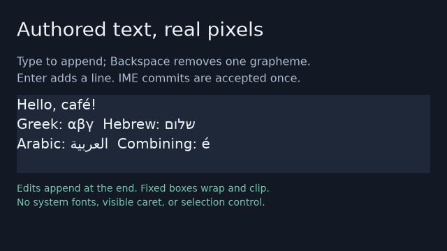

# Authored text application example

This standalone consumer displays real shaped text through the public
`fenestra-ui` facade and `fenestra-ui-text` adapter. A build script compiles
[panel.fen](src/panel.fen), and [panel.ui](src/panel.ui) uses the real `ui!`
macro. Tests compare their resulting views. Application code uses named
elements and owned text; it assigns no internal runtime identities.

The example supplies the repository's licensed
[DejaVu Sans font](../../assets/fonts/dejavu-sans-2.37/README.md) explicitly.
It does not discover system fonts. The sample includes Latin, Greek, Hebrew,
Arabic, and combining characters covered by that font. Unsupported glyphs,
including the tested CJK and emoji samples, produce a typed error.

Run from the repository root:

```sh
cargo run --manifest-path examples/text-app/Cargo.toml --locked
cargo test --manifest-path examples/text-app/Cargo.toml --locked
```

Add `--ppm PATH` to export the final frame explicitly:

```sh
cargo run --manifest-path examples/text-app/Cargo.toml --locked -- --ppm /tmp/text-headless.ppm
cargo run --manifest-path examples/text-app/Cargo.toml --locked --features native -- --native-smoke --ppm /tmp/text-presented.ppm
```

This exports the RGB channels of the application's final premultiplied RGBA8
raster as binary PPM. Transparent pixels appear over black. With smoke mode,
export happens after a successful native presentation. It is a frame export,
not a desktop screenshot, and contains no window decorations or compositor
effects. Exporting leaves the printed RGBA8 checksum unchanged.

The default run opens no window. It appends a line with `TextBuffer`, calls
`Application::set_text`, changes font size, line height, and foreground color
with `set_text_style`, and reports committed generation, text bytes, line and
glyph counts, and a checksum of the RGBA8 frame. The tests compare repeated
runs and confirm that content and pixels remain unchanged after rejected
glyphs or invalid typography. The checksum describes this committed font and
locked adapter version; it is not a promise across dependency changes.

The verified headless output for this font and lockfile is:

```text
generation=3 nodes=5 text_bytes=117 lines=4 glyphs=94 missing=0 rgba_bytes=921600 checksum=23758408e9c7bfb6
```

The package has its own workspace and lockfile. Its normal application
dependencies are `fenestra-ui` and `fenestra-ui-text`; `fenestra-ui-authoring`
is used only by the host build script. Native window dependencies are optional.

```sh
cargo tree --manifest-path examples/text-app/Cargo.toml --locked --edges normal,no-proc-macro
```

## Native editing demonstration

On a supported Linux Wayland or Windows desktop:

```sh
cargo run --manifest-path examples/text-app/Cargo.toml --release --locked --features native -- --native
cargo run --manifest-path examples/text-app/Cargo.toml --release --locked --features native -- --native-smoke
cargo test --manifest-path examples/text-app/Cargo.toml --locked --features native
```

The window opts into IME notifications. Printable `KeyboardInput::text`
appends at the end, Enter inserts a newline, and Backspace removes one extended
grapheme. IME preedit changes a status message without inserting provisional
content; `ImeEvent::Commit` inserts committed content once. Compatibility
`SpacePressed` notifications do not insert additional spaces. Focus loss and
IME disable clear the application's composition state.

Edits have a 4 KiB UTF-8 limit. Rejected edits or unsupported glyphs preserve
both the published text and the application's buffer, with an explanatory
status message. There is no visible caret, selection, cursor movement,
clipboard, candidate-window positioning, focusable text control, or native
accessibility implementation. The entire window edits one text buffer.
Synthetic event tests check the event policy; they do not qualify a platform's
keyboard layout, IME, or assistive technology behavior. Smoke mode exits after
one successful presentation without injecting input.

The verified Wayland frame below is an RGB export after a successful smoke
presentation. It is application content, not a desktop screenshot. Debug and
optimized smoke exports matched exactly; the
[verification record](../../docs/verification/WU-0019-authored-text-views.md)
records the environment and checksum.



## Text syntax and sizing

```text
text title {
  content: "Hello\nworld";
  width: 240;
  height: 60;
  font_size: 20;
  line_height: 28;
  color: rgba8(235, 241, 246, 255);
}
```

`content` is required exactly once. Cooked and raw Rust string literals retain
Unicode content and ordinary comment markers. Typography accepts font sizes
from 1 through 512 and line heights from 1 through 2048; colors are RGBA8.
Text leaves cannot contain children, padding, or gap. Width and height remain
fixed viewport pixels: the adapter wraps text to the width and clips its
raster to the box. Full text metrics include clipped lines. Resizing the
window does not stretch this fixed view.

Generated expressions use the canonical `fenestra_ui` crate name. A renamed
dependency needs a crate-root alias, as described in the
[typed application design](../../docs/design/typed-application-api.md).
